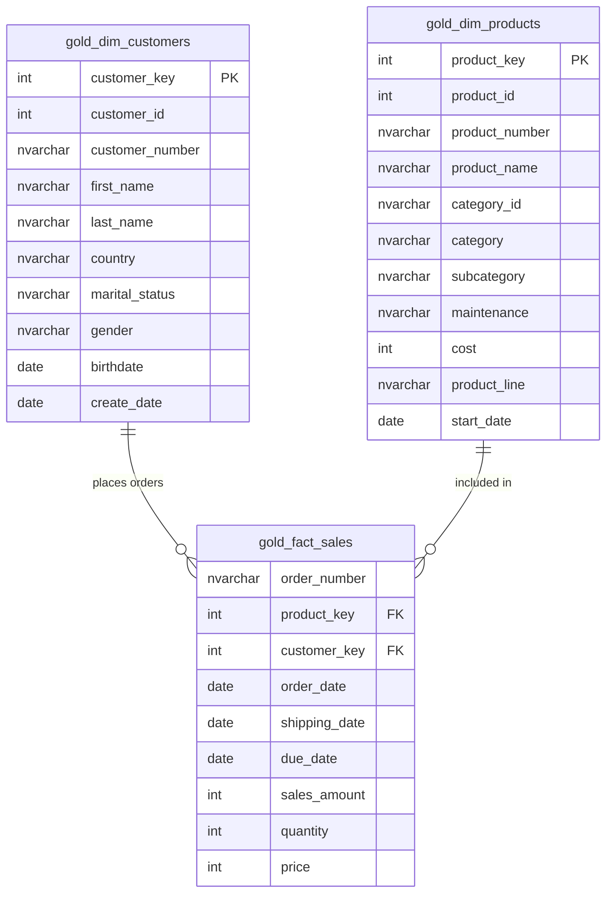

# 📊 SQL Data Analytics & Data Warehousing Project

Welcome to the **SQL Data Analytics & Data Warehousing Project** repository! This repository contains an end-to-end Data Warehousing and Analytical SQL solution built on Microsoft SQL Server (T-SQL).

It demonstrates data architecture design (Star Schema Gold Layer), automated ETL/bulk data loading, exploratory data analysis (EDA), advanced SQL analytics (time-series trends, cumulative metrics, data segmentation, ranking, YoY benchmarking), and production-grade business reporting views.

---

## 📁 Repository Structure

```
sql_data_analytics_project/
├── datasets/
│   └── csv_files/
│       ├── gold.dim_customers.csv       # Customer dimension dataset
│       ├── gold.dim_products.csv        # Product dimension dataset
│       └── gold.fact_sales.csv          # Transactional sales fact dataset
├── scripts/
│   ├── init_database.sql                # Database creation, schema definition, and BULK INSERT script
│   ├── database_exploration.sql         # System catalog queries (tables, columns, schemas)
│   ├── date_range_exploration.sql       # Time boundaries & span analysis
│   ├── dimensions_exploration.sql       # Categorical dimensions exploration
│   ├── measures_exploration.sql         # Core aggregations & baseline metrics
│   ├── magnitude_analysis.sql           # Category & regional distribution breakdown
│   ├── ranking_analysis.sql             # Top/Bottom N ranking via window functions
│   ├── change_over_time_analysis.sql    # Time-series trend & seasonality analysis
│   ├── cumulative_analysis.sql          # Running totals & moving averages
│   ├── performance_analysis.sql         # Year-over-Year (YoY) & benchmark comparison
│   ├── part_to_whole_analysis.sql       # Percentage contribution & proportion analysis
│   ├── data_segmentation.sql            # Customer profiling & product price segmentation
│   ├── customer_report.sql              # Consolidated customer reporting view (gold.report_customers)
│   └── products_report.sql              # Consolidated product reporting view (gold.report_products)
├── LICENSE                              # MIT License
└── README.md                            # Project documentation
```

---

## 🏗️ Data Architecture & Star Schema

The project models an enterprise sales data warehouse using a **Star Schema** architecture within the `gold` schema:



### Table Overview:
1. **`gold.dim_customers`**: Dimension table storing customer demographics, marital status, age details, and geographic location.
2. **`gold.dim_products`**: Dimension table storing product categorization, subcategories, unit costs, and product line details.
3. **`gold.fact_sales`**: Fact table storing granular sales transactions, key references, order dates, quantities, prices, and total revenue.

---

## 🚀 Getting Started

### Prerequisites
- **Database Engine**: Microsoft SQL Server 2016+ (or Azure SQL Database / Managed Instance).
- **Client Tool**: SQL Server Management Studio (SSMS) or Azure Data Studio.

### Setup Instructions

1. **Clone the Repository**:
   ```bash
   git clone https://github.com/your-username/sql_data_analytics_project.git
   cd sql_data_analytics_project
   ```

2. **Initialize Database & Load Data**:
   - Open [`scripts/init_database.sql`](scripts/init_database.sql) in SSMS or Azure Data Studio.
   - Update the file path in `BULK INSERT` statements to point to your local path where the dataset CSV files are stored:
     ```sql
     BULK INSERT gold.dim_customers
     FROM 'C:\path\to\your\repository\datasets\csv_files\gold.dim_customers.csv'
     WITH (FIRSTROW = 2, FIELDTERMINATOR = ',', TABLOCK);
     ```
   - Execute the script to drop/re-create the `DataWarehouseAnalytics` database, create the `gold` schema, build tables, and bulk-load data.

---

## 📈 Analytical Modules & SQL Scripts

This repository is organized into distinct analytical modules, each addressing specific business intelligence needs:

| Module / Script | Description | Key SQL Techniques Used |
| :--- | :--- | :--- |
| **[`init_database.sql`](scripts/init_database.sql)** | Re-creates DB, `gold` schema, DDL for tables, and loads CSV datasets. | `CREATE DATABASE`, `BULK INSERT`, DDL |
| **[`database_exploration.sql`](scripts/database_exploration.sql)** | System catalog exploration of schemas, tables, and column metadata. | `sys.tables`, `INFORMATION_SCHEMA` |
| **[`date_range_exploration.sql`](scripts/date_range_exploration.sql)** | Finds dataset date boundaries, order date spans, and customer age ranges. | `MIN()`, `MAX()`, `DATEDIFF()` |
| **[`dimensions_exploration.sql`](scripts/dimensions_exploration.sql)** | Lists unique categories, subcategories, countries, and gender distributions. | `DISTINCT`, `GROUP BY`, `ORDER BY` |
| **[`measures_exploration.sql`](scripts/measures_exploration.sql)** | Computes core business aggregates (total sales, total quantity, total orders). | `SUM()`, `COUNT()`, `AVG()` |
| **[`magnitude_analysis.sql`](scripts/magnitude_analysis.sql)** | Analyzes revenue distribution by category, country, gender, and customer. | Categorical aggregation & grouping |
| **[`ranking_analysis.sql`](scripts/ranking_analysis.sql)** | Identifies top & bottom N products, top customers, and ranked sales. | `ROW_NUMBER()`, `RANK()`, `DENSE_RANK()` |
| **[`change_over_time_analysis.sql`](scripts/change_over_time_analysis.sql)** | Tracks monthly & annual sales trends and seasonal growth. | `DATETRUNC()`, `FORMAT()`, `DATEPART()` |
| **[`cumulative_analysis.sql`](scripts/cumulative_analysis.sql)** | Computes running sales totals and moving average prices over time. | `SUM() OVER ()`, `AVG() OVER ()` |
| **[`performance_analysis.sql`](scripts/performance_analysis.sql)** | Benchmarks product sales against overall average and calculates Year-over-Year (YoY) growth. | `LAG()`, Window Partitioning, `CASE` statements |
| **[`part_to_whole_analysis.sql`](scripts/part_to_whole_analysis.sql)** | Measures category contribution as a percentage of total overall revenue. | `SUM() / SUM() OVER ()`, Ratio calculations |
| **[`data_segmentation.sql`](scripts/data_segmentation.sql)** | Groups products into price bands and segments customers into VIP, Regular, and New tiers. | `CASE WHEN`, Subqueries, CTEs |

---

## 📑 Business Reports & Analytical Views

The repository includes two production-grade analytical reporting views built for BI dashboards and executive decision-making:

### 1. Customer Insights Report (`gold.report_customers`)
File: [`scripts/customer_report.sql`](scripts/customer_report.sql)
- **Key Metrics**: Total Orders, Total Sales, Total Quantity, Total Products Purchased, Customer Lifespan (months).
- **Derived KPIs**:
  - **Recency**: Months since last order.
  - **Average Order Value (AOV)**: `Total Sales / Total Orders`.
  - **Average Monthly Spend**: `Total Sales / Customer Lifespan`.
- **Segmentation**:
  - **Age Groups**: Under 20, 20-29, 30-39, 40-49, 50+.
  - **Customer Tier**: `VIP` (Lifespan ≥ 12 mos & Sales > $5,000), `Regular` (Lifespan ≥ 12 mos & Sales ≤ $5,000), `New` (< 12 mos).

### 2. Product Insights Report (`gold.report_products`)
File: [`scripts/products_report.sql`](scripts/products_report.sql)
- **Key Metrics**: Total Orders, Total Sales, Total Quantity Sold, Unique Customer Count, Product Lifespan (months), Average Selling Price.
- **Derived KPIs**:
  - **Recency**: Months since last sale date.
  - **Average Order Revenue (AOR)**: `Total Sales / Total Orders`.
  - **Average Monthly Revenue**: `Total Sales / Product Lifespan`.
- **Segmentation**:
  - **Product Performance Tier**: `High-Performer` (Sales > $50,000), `Mid-Range` ($10,000–$50,000), `Low-Performer` (< $10,000).

---

## 🛠️ Tech Stack & Skills Highlighted

- **SQL Engine**: Microsoft SQL Server (T-SQL)
- **Data Modeling**: Dimensional Modeling, Star Schema Design (Fact & Dimension Tables)
- **ETL Process**: Data Ingestion, Bulk Operations (`BULK INSERT`), Schema Enforcement
- **Advanced SQL Analytics**:
  - Window Functions (`ROW_NUMBER`, `RANK`, `DENSE_RANK`, `LAG`, `SUM OVER`, `AVG OVER`)
  - Complex CTEs & Subqueries
  - Time Series & Trend Analysis (`DATETRUNC`, `FORMAT`, `DATEDIFF`)
  - Data Segmentation & RFM-style Profiling
  - Database View Design & Reporting Layer Optimization

---

## 📜 License

This project is licensed under the [MIT License](LICENSE) - see the `LICENSE` file for details.
